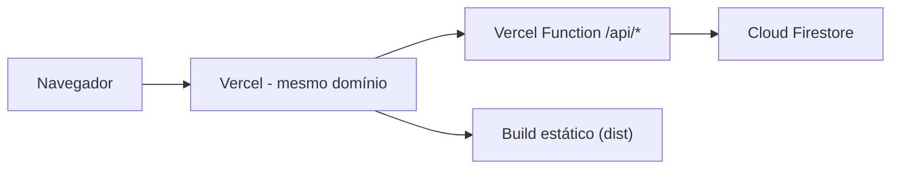

# Plataforma do Laboratório de Eletrônica

Sistema de gestão acadêmica para o **Laboratório de Eletrônica do IFCE Campus Maranguape**. A plataforma conecta professores, alunos e administração em um único ambiente: o professor cria e corrige listas de exercícios, gerencia turmas e equipes e acompanha o desempenho; os alunos resolvem listas, recebem notas e notificações e trabalham em equipe com convites; e a administração gerencia todas as contas pelo painel administrativo.


---

## Sumário

- [Funcionalidades](#funcionalidades)
- [Tecnologias](#tecnologias)
- [Estrutura do projeto](#estrutura-do-projeto)
- [Começando](#começando)
- [Variáveis de ambiente](#variáveis-de-ambiente)
- [Banco de dados e seed](#banco-de-dados-e-seed)
- [Painel administrativo](#painel-administrativo)
- [Deploy na Vercel](#deploy-na-vercel)
- [Visão geral da API](#visão-geral-da-api)
- [Credenciais de teste](#credenciais-de-teste)
- [Scripts](#scripts)
- [Licença](#licença)

---

## Funcionalidades

### Autenticação e perfis (RBAC)

- Três papéis com controle de acesso completo: **ALUNO**, **PROFESSOR** e **ADMIN**.
- Login do aluno por **matrícula**; professor por **e-mail**; administrador por **usuário**.
- Senhas criptografadas com `bcrypt` e sessões com **JWT** (expiração configurável).
- Rotas protegidas por papel tanto no backend (`authenticate` + `authorize`) quanto no frontend (`ProtectedRoute` + `Sidebar` por papel).

### Aluno

- **Início** — resumo com estatísticas, convites pendentes, prazos, atividades recentes e notificações.
- **Minha Equipe** — criar equipe, convidar colegas, aceitar/recusar convites, transferir liderança, remover membros, sair ou excluir a equipe.
- **Listas** — visualizar listas publicadas, prazos e responder questões de 4 tipos (múltipla escolha, verdadeiro/falso, resposta curta e dissertativa).
- **Histórico** — notas e feedback de todas as entregas corrigidas.
- **Notificações** — avisos de convites, listas publicadas e correções realizadas.

### Professor

- **Início** — estatísticas da turma, listas pendentes de correção e atividades recentes.
- **Listas** — criar, editar, publicar, duplicar e excluir listas, com prazo e turma configuráveis.
- **Correções** — revisar entregas, atribuir nota e feedback (com sugestão automática de pontos objetivos) e notificar o aluno.
- **Alunos** — lista com matrícula, curso, semestre e desempenho.
- **Equipes** — visualizar todas as equipes e seus integrantes.
- **Relatórios** — gráficos de desempenho por aluno e por lista com dados agregados do banco.

### Administrador

- **Painel** — estatísticas gerais (alunos, professores, ativos e inativos).
- **Contas** — criar contas de alunos, professores e administradores; editar dados; redefinir senhas; ativar/desativar acessos.
- Acesso pela rota `/login/admin` (link na landing page).

### Plataforma

- Interface **100% em pt-BR**, tema verde institucional, responsiva (desktop/tablet/mobile).
- Componentes de UI reutilizáveis, feedback visual com toasts e formulários com validação.
- Backend e frontend publicados no **mesmo domínio** (SPA + API `/api/*`), sem depender de CORS ou proxy em produção.

---

## Tecnologias

**Backend** (`laboratorio-eletronica/backend/`)

| Ferramenta | Uso |
|---|---|
| Node.js + Express | API REST |
| Firebase Admin SDK + Firestore | Banco de dados (camada `src/db/firestore.js` com API compatível com o Prisma) |
| jsonwebtoken | Autenticação por tokens JWT |
| bcryptjs | Hash de senhas |
| cors + dotenv | CORS e variáveis de ambiente |

**Frontend** (`laboratorio-eletronica/frontend/`)

| Ferramenta | Uso |
|---|---|
| React 18 | Interface de usuário |
| Vite | Bundler e dev server (com proxy `/api` → `localhost:3001`) |
| React Router v6 | Roteamento com guardas de papel |
| CSS padrão | Estilização sem frameworks, tema institucional |

---

## Estrutura do projeto

```
laboratorio-eletronica/
├── backend/
│   ├── src/
│   │   ├── server.js            # Entrada da API (porta 3001)
│   │   ├── config/              # env + inicialização do Firebase
│   │   ├── db/firestore.js      # Camada de acesso ao Firestore
│   │   ├── controllers/         # Auth, aluno, professor, equipes, listas, entregas, relatórios, admin...
│   │   ├── services/            # Notificações e Storage
│   │   ├── middleware/          # Auth JWT, autorização por papel e error handler
│   │   └── routes/              # Rotas /api
│   ├── prisma/seed.js           # Seed que popula o Firestore
│   ├── scripts/createAdmin.js   # Cria administrador sem apagar dados
│   ├── .env.example
│   └── package.json
└── frontend/
    ├── src/
    │   ├── pages/               # Públicas, aluno, professor, admin e compartilhadas
    │   ├── components/          # Sidebar, ProtectedRoute e UI kit
    │   ├── context/             # Auth e Toast
    │   ├── services/api.js      # Cliente HTTP da API
    │   ├── layouts/             # PublicLayout e PanelLayout
    │   ├── routes/              # Árvore de rotas com guardas de papel
    │   └── styles/              # CSS global
    ├── vite.config.js           # Porta 5173 + proxy /api
    └── package.json
```

**Arquitetura em produção (Vercel)**



---

## Começando

### Pré-requisitos

- **Node.js 18+**
- Projeto no **Firebase** com **Firestore** habilitado e um **service account** (JSON)

### 1. Configurar o Firebase

1. Crie um projeto no [Firebase](https://console.firebase.google.com) e habilite o **Cloud Firestore**.
2. Gere um service account: **Configurações do projeto > Contas de serviço > Gerar nova chave privada**.
3. Copie `laboratorio-eletronica/backend/.env.example` para `laboratorio-eletronica/backend/.env` e preencha (veja [Variáveis de ambiente](#variáveis-de-ambiente)).

### 2. Backend

```bash
cd laboratorio-eletronica/backend
npm install
npm run seed       # opcional: popula o Firestore com dados de demonstração
npm start          # ou npm run dev (hot reload)
```

A API sobe em `http://localhost:3001` (health check em `GET /api/health`).

### 3. Frontend

```bash
cd laboratorio-eletronica/frontend
npm install
npm run dev
```

O frontend sobe em `http://localhost:5173` e encaminha as requisições `/api/*` para o backend via proxy.

---

## Variáveis de ambiente

Arquivo `laboratorio-eletronica/backend/.env` (base: `backend/.env.example`):

| Variável | Descrição | Obrigatória |
|---|---|---|
| `PORT` | Porta da API | não (padrão 3001) |
| `JWT_SECRET` | Segredo para assinar os tokens JWT | sim |
| `JWT_EXPIRES_IN` | Tempo de expiração (ex.: `8h`) | sim |
| `BCRYPT_SALT_ROUNDS` | Custo do hash de senha | sim |
| `CLIENT_URL` | Origem permitida pelo CORS | sim |
| `FIREBASE_PROJECT_ID` | ID do projeto Firebase | sim |
| `FIREBASE_SERVICE_ACCOUNT` | JSON do service account (ou base64) | sim |

> Sem `FIREBASE_SERVICE_ACCOUNT` a API inicia, mas as operações no Firestore retornam `FIREBASE_NOT_CONFIGURED`.

---

## Banco de dados e seed

O projeto usa o **Cloud Firestore** como banco. A camada `src/db/firestore.js` expõe uma API compatível com a utilizada anteriormente pelo Prisma, mantendo controllers e rotas estáveis.

O seed (`npm run seed`) popula o Firestore com:

- 1 administrador, 1 professor e 5 alunos;
- 2 equipes;
- 4 listas de exercícios;
- entregas já corrigidas para demonstração.

> O seed **limpa e recria todos os dados**. Rode-o apenas para restaurar o estado de demonstração. Para criar um administrador **sem apagar nada**, use `npm run create-admin`.

---

## Painel administrativo

O papel **ADMIN** acessa o painel em `/login/admin` (link na landing page):

- **Criar contas** de alunos (matrícula, curso e período), professores e administradores.
- **Editar** nome, e-mail, curso/período e **redefinir senha**.
- **Ativar/desativar** contas — usuários inativos não conseguem mais entrar.

Para criar um administrador sem passar pelo painel (ex.: primeira vez em produção):

```bash
cd laboratorio-eletronica/backend
npm run create-admin -- "Nome do Admin" "usuario" "senha-forte"
```

---

## Deploy na Vercel

O repositório inclui um `vercel.json` na **raiz** que publica frontend e backend em um único projeto:

- `api/index.js` reexporta o app Express como uma [Vercel Function](https://vercel.com/docs/functions) que atende todas as rotas `/api/*`.
- O frontend é compilado com `vite build` e o `dist` servido como SPA.
- `rewrites`: `/api/(.*)` vai para a função; o restante cai no `index.html`.

**Passos:**

1. Importe o repositório em [vercel.com/new](https://vercel.com/new), mantendo o **Root Directory** na raiz.
2. Em **Settings > Environment Variables**, configure as mesmas variáveis do [.env](#variáveis-de-ambiente), com `CLIENT_URL` apontando para `https://seu-dominio.vercel.app`.
3. Faça o deploy. As chamadas a `/api/*` são **same-origin**, sem depender de CORS ou proxy.

---

## Visão geral da API

| Método | Rota | Descrição |
|---|---|---|
| POST | `/api/auth/student/login` | Login do aluno (matrícula) |
| POST | `/api/auth/teacher/login` | Login do professor (e-mail) |
| POST | `/api/auth/admin/login` | Login do administrador (usuário) |
| GET | `/api/profile` | Perfil do usuário autenticado |
| GET | `/api/dashboard` | Dados do painel por papel |
| GET/POST | `/api/teams` | Listar/criar equipes |
| POST | `/api/teams/:id/invitations` | Convidar aluno para equipe |
| POST | `/api/invitations/:id/accept` / `reject` | Responder convite |
| GET/POST | `/api/assignments` | Listar/criar listas de exercícios |
| POST | `/api/assignments/:id/submit` | Enviar entrega |
| GET | `/api/submissions` | Listar entregas |
| PUT | `/api/submissions/:id/grade` | Corrigir entrega |
| GET/PUT | `/api/notifications` | Listar/marcar notificações |
| GET | `/api/reports` | Relatórios de desempenho |
| GET | `/api/admin/stats` | Estatísticas gerais (ADMIN) |
| GET/POST | `/api/admin/accounts` | Listar/criar contas (ADMIN) |
| PUT | `/api/admin/accounts/:id` | Editar/desativar conta (ADMIN) |

---

## Credenciais de teste

Contas criadas pelo seed (senha padrão `123456`, exceto o administrador):

| Papel | Usuário | Senha |
|---|---|---|
| Administrador | `adminifce67` | `adminifce67` |
| Professor | `professor@lab.com` | `123456` |
| Aluno | `2024101001` — Ana Beatriz Souza | `123456` |
| Aluno | `2024101002` — Bruno Oliveira | `123456` |
| Aluno | `2024101003` — Carla Fernanda Lima | `123456` |
| Aluno | `2024101004` — Diego Almeida | `123456` |
| Aluno | `2024101005` — Eduarda Santos | `123456` |

---

## Scripts

**Backend** (`cd laboratorio-eletronica/backend`)

| Script | Descrição |
|---|---|
| `npm start` | Inicia a API em `localhost:3001` |
| `npm run dev` | Inicia com hot reload |
| `npm run seed` | Popula o Firestore (limpa e recria os dados) |
| `npm run create-admin` | Cria um administrador sem apagar dados |

**Frontend** (`cd laboratorio-eletronica/frontend`)

| Script | Descrição |
|---|---|
| `npm run dev` | Dev server em `localhost:5173` com proxy `/api` |
| `npm run build` | Gera o build de produção em `dist/` |
| `npm run preview` | Serve o build gerado |

---

## Licença

Projeto acadêmico desenvolvido para o IFCE Campus Maranguape. Uso educacional.
